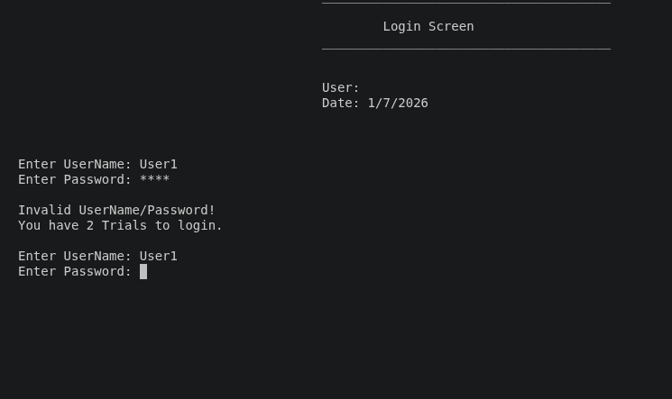
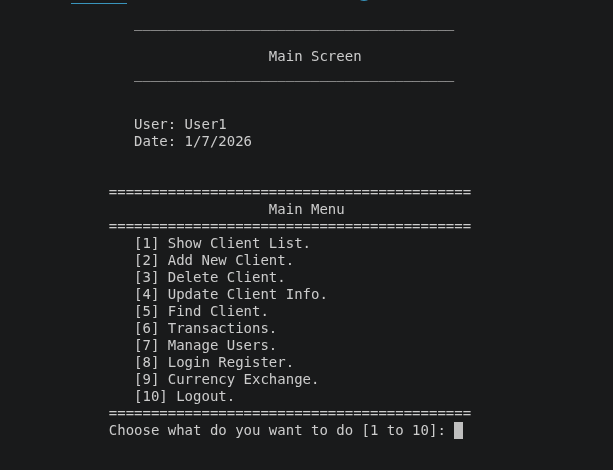
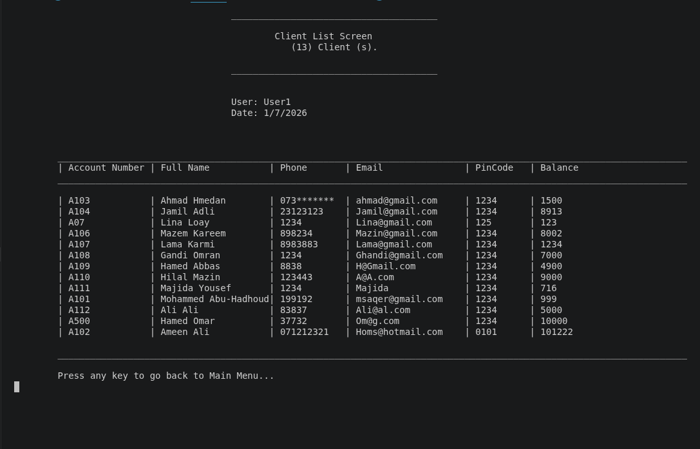
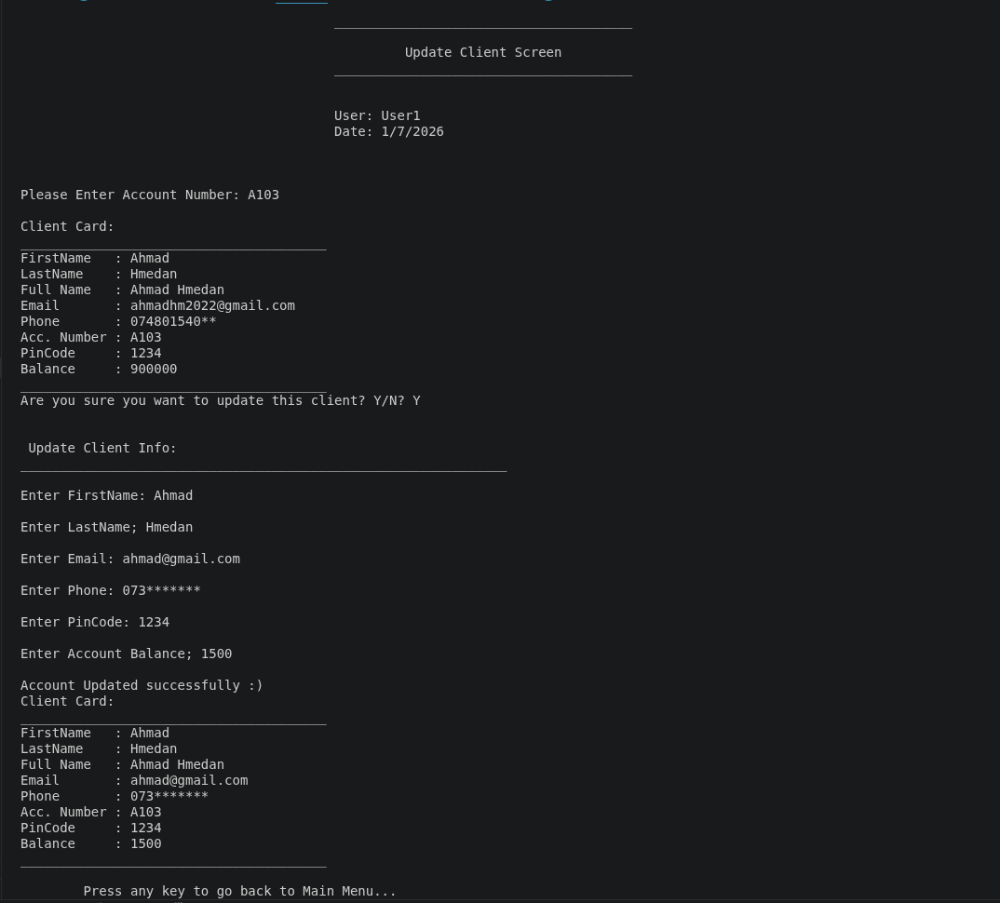
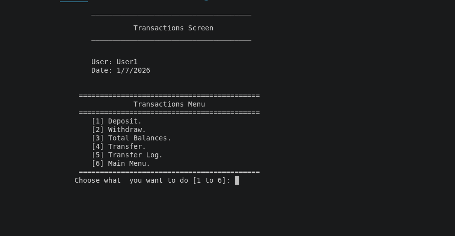
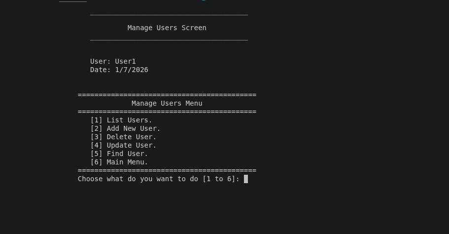
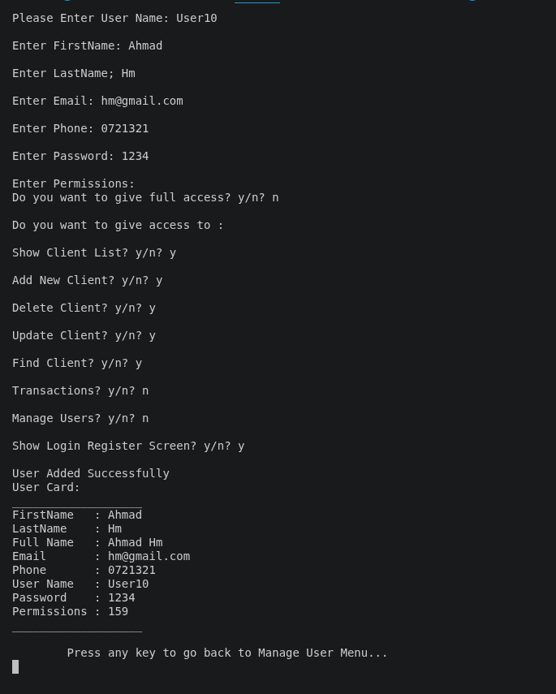

# Bank Management System — C++ OOP Console Application

> ⚠️ **Educational Project**
>
> This project was built for educational purposes to practice Object-Oriented Programming, software design, and C++ development. It is **not intended for production use**.

## Overview

This project is a console-based Bank Management System built with C++.

The project was originally developed using procedural programming, then rebuilt using Object-Oriented Programming to practice class design, encapsulation, inheritance, modular code organization, file persistence, and role-based access control.

The goal of this project is educational: to apply OOP concepts in a complete application rather than isolated exercises.


## Demo
### Login Screen



---

### Main Menu



---

### Client List



---

### Update Client



---

### Transactions



---

### User Management



---


### Permissions 



---

### Permissions Denied


---

## Features

### Authentication

- User login system

### Client Management (CRUD)

- Create new clients
- View all clients
- Search clients
- Update client information
- Delete clients

### Transactions

- Deposit
- Withdraw
- Transfer between accounts
- Transfer log
- Total balance report

### User Management

- Create users
- View users
- Search users
- Update users
- Delete users

### Security

- Role-Based Access Control (RBAC)
- Permission checking using bitwise flags

### Data Storage

- File-based persistence using text files

### Utility Libraries

Reusable helper classes for:

- String manipulation
- Date handling
- Input validation
- General utility functions

---

## Key Concepts Demonstrated

- Object-Oriented Programming (OOP)
- Encapsulation
- Inheritance
- Modular code organization
- File persistence
- Role-Based Access Control (RBAC)
- Menu-driven application design
- Bitwise permission flags
- Separation of UI and business logic
- STL containers (`vector`, `string`)

---

## Technologies Used

* C++
* Object-Oriented Programming
* STL `vector` and `string`
* File I/O with `fstream`
* Header files and modular project structure
* Enums
* Bitwise Permission Flags
* Inheritance
* Encapsulation
* Console UI

## Project Structure


```text
OOP-Application/
│
├── include/
│   ├── Core/
│   ├── Lib/
│   └── Screens/
│
├── src/
│   └── Main.cpp
│
├── Data/
│   ├── HmedanBank.txt
│   └── Users.txt
│
├── Screenshots/
│
├── README.md
```

---

## How to Build

Compile the project:

## How to Build

Compile the project:

```bash
g++ src/Main.cpp -Iinclude -o app
```

Run:

```bash
./app
```
---

## Learning Outcomes

Through this project I learned:

- Converting a procedural application into an object-oriented design
- Designing classes with clear responsibilities
- Applying encapsulation and inheritance
- Organizing larger C++ projects into multiple modules
- Reading and writing persistent data using files
- Implementing authentication and authorization
- Building reusable utility libraries
- Separating presentation from business logic
- Debugging and refactoring larger applications
- Using Git and GitHub to manage software projects

---


## Current Limitations

* Password handling is basic and not production-secure.
* Data is stored in text files instead of a database.
* Some menu navigation still needs further refactoring.
* The project is designed for learning, not real banking use.
* More validation and error handling can be added.

## Future Improvements

* Refactor menu navigation into loop-based flow
* Split more implementation into `.cpp` files
* Add unit tests
* Add stronger error handling
* Add password hashing
* Replace text files with a database
* Improve architecture using service/repository classes
* Add a graphical or web-based interface in the future

---

## Repository Purpose

This repository documents my progression from **procedural programming** to **Object-Oriented Programming**.

It represents an important milestone in my learning journey and serves as the foundation for future projects involving **Data Structures**, **C#**, **SQL**, and **.NET**.

---
## Project Evolution
Version 1
✔ Procedural Programming
✔ Functions
✔ Structs
✔ Single-file architecture

Version 2 (Current)
✔ Object-Oriented Programming
✔ Class-based architecture
✔ Encapsulation
✔ Inheritance
✔ Modular organization
✔ Authentication
✔ Role-based permissions

Next Version
🔄 Data Structures
🔄 C#
🔄 SQL
🔄 .NET
🔄 Desktop Application
🔄 REST API

## Author

**Ahmad Hmedan**

GitHub: https://github.com/AhmadHmedann